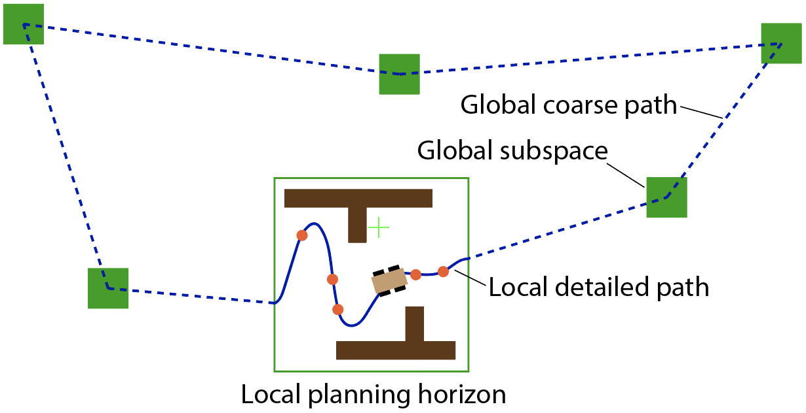
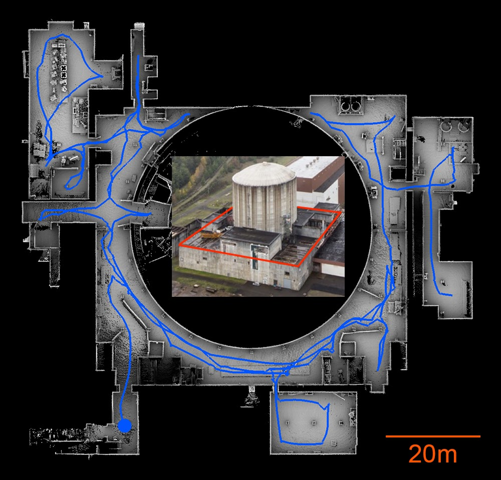

This repository implements the TARE exploration planner for ground robots.

## Method Overview

TARE hierarchical exploration framework: Inside the local planning horizon, data is densely maintained and a local detailed path (dark-blue) is computed. At the global scale, data is sparsely maintained in the distant subspaces and a global coarse path (light-blue) is computed. The local path and global path are connected on the boundary of the local planning horizon to form the exploration path.
## Usage
To setup TARE Planner, clone our repository.
```
git clone https://github.com/caochao39/tare_planner.git
```
In a terminal, go to the folder and checkout the correct branch. Replace '\<distribution\>' with 'melodic' or 'noetic'. Then, compile.

```
cd tare_planner
git checkout <distribution>
catkin_make
```
To run the code, go to the [development environment](http://cmu-exploration.com) folder in a terminal, source the ROS workspace, and launch.
```
source devel/setup.sh
roslaunch vehicle_simulator system_garage.launch
```
In another terminal, go to the TARE Planner folder, source the ROS workspace, and launch with the corresponding scenario.
```
source devel/setup.sh
roslaunch tare_planner explore_garage.launch
```
Now, users should see autonomous exploration in action. To launch with a different environment, use the command lines below instead and replace '\<environment\>' with one of the environment names in the development environment, i.e. 'campus', 'indoor', 'garage', 'tunnel', and 'forest'.
```
roslaunch vehicle_simulator system_<environment>.launch
roslaunch tare_planner explore_<environment>.launch
```
#### Launch with arguments
* rosbag_record: record a rosbag or not. If ```=true```, rosbags will be recorded to ```[home]/<bag_path>/<bag_name_prefix>_<timestamp>.bag``` with both the input and output topics from the planner. Note that '\<bag_path\>' and '\<bag_name_prefix\>' are both launch arguments that can be specified by the user.

* rviz: launch Rviz for visualization or not. If ```=true```, Rviz will be launched.

## Publications
- C. Cao, H. Zhu, H. Choset, and J. Zhang. TARE: A Hierarchical Framework for Efficiently Exploring Complex 3D Environments. Robotics: Science and Systems Conference (RSS). Virtual, July 2021.
- C. Cao, H. Zhu, H. Choset, and J. Zhang: Exploring Large and Complex Environments
Fast and Efficiently. International Conference on Robotics and Automation (ICRA), Xi'an, China, June 2021.
```
@inproceedings{chao2021tare,
  title={TARE: A Hierarchical Framework for Efficiently Exploring Complex 3D Environments},
  author={Chao, Cao and Hongbiao, Zhu and Howie, Choset and Ji, Zhang},
  booktitle={Robotics: Science and Systems Conference (RSS)},
  year={2021},
  month={July},
  address={Virtual}
}
@inproceedings{chao2021exploring,
  title={Exploring Large and Complex Environments
Fast and Efficiently},
  author={Chao, Cao and Hongbiao, Zhu and Howie, Choset and Ji, Zhang},
  booktitle={IEEE International Conference on Robotics and Automation (ICRA)},
  year={2021},
  month={June},
  address={Xi'an, China}
}
```
## Application
TARE planner has been used by the [CMU-OSU Team](https://www.subt-explorer.com/) in attending the [DARPA Subterranean Challenge](https://www.subtchallenge.com/).

Urban circuit competition result from DARPA Subterranean Challenge in Satsop Nuclear Plant, WA. Our vehicle travels over 886m in 1458s to explore the site, fully autonomously.

### Authors 
Chao Cao (ccao1@andrew.cmu.edu)

### Credit
[OR-Tools](https://developers.google.com/optimization) is from Google